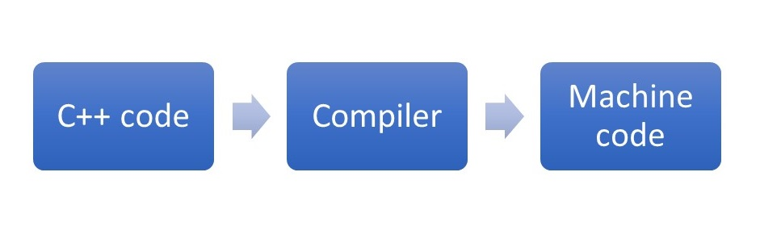
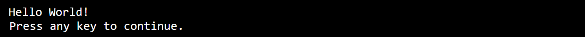

## How to Write Your First Program in C++

Many applications are running for specific tasks on computer every day. You might be curious about how to write such a program. One of popular programming lanugages is C++. Programs written in C++ language is generally faster and smaller than programs in the other languages.

To start writing a program in C++, you need two things.
- A text editor, like Notepad++, to write C++ source code
- A compiler, like Clang, GCC, VC to translate the C++ code into a machine language that the computer can understand.




### First Run

Write the following code and run compiler.
```C++
#include <iostream>

void main() {
  std::cout << "Hello world!";
}
```
And then, run the compiled program. Then, the output should look like this.


Markdown is a lightweight and easy-to-use syntax for styling your writing. It includes conventions for

```markdown
Syntax highlighted code block

# Header 1
## Header 2
### Header 3

- Bulleted
- List

1. Numbered
2. List

**Bold** and _Italic_ and `Code` text
```
[Link](url) and 

For more details see [GitHub Flavored Markdown](https://guides.github.com/features/mastering-markdown/).

### Jekyll Themes

Your Pages site will use the layout and styles from the Jekyll theme you have selected in your [repository settings](https://github.com/jinakimSTEM/main/settings/pages). The name of this theme is saved in the Jekyll `_config.yml` configuration file.

### Support or Contact

Having trouble with Pages? Check out our [documentation](https://docs.github.com/categories/github-pages-basics/) or [contact support](https://support.github.com/contact) and we’ll help you sort it out.
